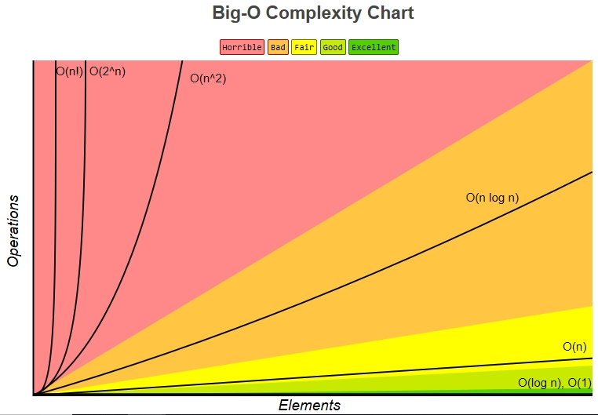

​	2019年的经济寒冬，是我从小到大感受到最慌张紧张的一年，不可否认，这种慌张感有很大一部分原因是来自于2019年之前的堕落和毫无规划的人生。这一年我感受到了职业的瓶颈期，不断打击我对自我的认可感。后来我开始记录生活中的美好，用微博这个社交圈去监督，同时也刻意开始培训自己的习惯，报班学习是其中一项，从今天开始学习极客时间上覃超的算法课程并并留下以博客的形式进行记录，希望这里有老师的分享也有我自己的见解，希望这端学习可以使我获得很大的成长。

## 算法时间复杂度

​	o()是表达一个算法复杂度的常用方式，常用的算法时间复杂度有：

| 时间复杂度表达式 |  意义解释  |
| :--------------: | :--------: |
|       o(1)       | 常数复杂度 |
|     o(logn)      | 对数复杂度 |
|       o(n)       | 线性复杂度 |
|      o(n^2)      |    平方    |
|      o(n^3)      |    立方    |
|      o(2^n)      |    指数    |
|      o(n!)       |   j阶乘    |

以图像的形式呈现如下图所示，可见随着n的增大，时间复杂度的差别更加明显。



以计算1到N的和为例，展示时间复杂度的计算

```C++
//循环N次，算法的时间复杂度为o(N)
sum = 0;
for(int i = 1;i < N;i++)
	sum += i;

//只运算一次，算法复杂度为o(1)
sum = N(N+1)/2
```

而对于斐波那契数组

```C++
//斐波那契数组：1，1， 2， 3，5， 8， 13， .....
//递归实现
def flib(n)
	if (n == 0 or n == 1)
		return n
	else
		return flib(n - 1) + flib(n - 2)
```

假设n为6，计算过程可以简化如下：


可见，斐波那契额数列的递归实现的时间复杂度为o(2^n)，虽然算法实现简单，但是其时间复杂度很高。这样也可以看出数据结构和算法对于算法的实现很重要。


## 常见数据结构操作复杂度


​                                                                            [图片来源](http://bigocheatsheet.com/)

## 常见排序算法复杂度


​						   [图片来源](http://bigocheatsheet.com/)

### 链表和数组

|  算法  | 查询 | 插入 | 删除 |
| :----: | :--: | :--: | :--: |
|  数组  | o(1) | o(N) | o(N) |
| 单链表 | o(N) | o(1) | o(1) |
| 双链表 | o(N) | o(1) | o(1) |


### Hash表


####  [有效的字母异位词](https://leetcode.com/problems/valid-anagram/description/)

```

```

```C++

```


#### [计算两数之和](https://leetcode-cn.com/problems/two-sum/)

```
思路一：
	暴力求解：
		执行两层for循环，对应的时间复杂度为O(N^2)
思路二：
	利用HashMap进行查找，假设求x+y=9,则y=9-x。对应的时间复杂度为O(N)。
		for x (nums[0]->nums[len])			O(N)
			map.find(9 - x)					O(1)
```

```C++
class Solution {
public:
    vector<int> twoSum(vector<int>& nums, int target) {
        vector<int> res;
        //创建HashMap
        std::unordered_map<int, int> tmp;
        for(int i = 0; i < nums.size();i++){
            auto num1 = tmp.find(target - nums[i]);
            //查找到符合条件的数据
            if(num1 != tmp.end()){
                res.push_back(i);
                res.push_back(num1->second);
            }
            //将(数据，索引)添加入HashMap。
           tmp[nums[i]] =  i;
        }
       return res; 
    }
};
```


#### [三个数之和](https://leetcode-cn.com/problems/3sum/)

##### 推荐解法


```
思路一：
	暴力求解，进行三个循环，对应的时间复杂度为O(N^3)
思路二：
	利用Set进行求解。
	for x = (nums[0] -> nums[len])				O(N)
	for y = (nums[0] -> nums[len])				O(N)
	z = -(x+y),转化为求两数之和问题。	   	     	O(1)
思路三：
	sort-find求解，可以节省空间。
	对nums进行排序，最快是快排。					O(NlogN)
	for x = (nums[0] -> nums[len])				O(N)
		y + z = sum - x;
		y = nums[0], z = nums[len]
		根据y+z的和移动y或者z		    		   O(N)
```

```C++
 class Solution {
public:
    vector<vector<int>> threeSum(vector<int>& nums) {
        vector<vector<int>> res;
        if(nums.size() < 3)
            return res;
        
        sort(nums.begin(), nums.end());
        for(int i = 0;i < nums.size() - 2;i++){
            //避免重复
            if(i > 0 && nums[i] == nums[i - 1])
                continue;
            
            int target = 0 - nums[i];
#if 1
            int low = i + 1;
            int high = nums.size() - 1;
            while(low < high){
                if(nums[low] + nums[high] > target){
                    high--;
                }else if(nums[low] + nums[high] < target){
                    low++;
                }else{
                    //查找到符合条件的
                    vector<int> xyz;
                    xyz.push_back(nums[i]);
                    xyz.push_back(nums[low]);
                    xyz.push_back(nums[high]);
                    res.push_back(xyz);
                    low++;
                    //避免重复
                    while(nums[low] == nums[low - 1] && low < high){
                        low++;
                    }
                }
            }
#else
            //缺少避免重复的方法
            set<int> tmp;
            for(int j = i + 1; j < nums.size();j++){
                auto num = tmp.find(target - nums[j]);
                if(num != tmp.end()){
                    vector<int> xyz;
                    xyz.push_back(nums[i]);
                    xyz.push_back(nums[j]);
                    xyz.push_back(*num);
                    res.push_back(xyz);
                }
                tmp.insert(nums[j]);
            }
#endif
        }
        return res;
    }
};
```


### 二叉搜索树


#### [二叉树的最近公共祖先](https://leetcode-cn.com/problems/lowest-common-ancestor-of-a-binary-tree/)

```C++
/**
 * Definition for a binary tree node.
 * struct TreeNode {
 *     int val;
 *     TreeNode *left;
 *     TreeNode *right;
 *     TreeNode(int x) : val(x), left(NULL), right(NULL) {}
 * };
 */
class Solution {
public:
    TreeNode* lowestCommonAncestor(TreeNode* root, TreeNode* p, TreeNode* q) {
        if(root == NULL || root == p || root == q)
            return root;
        TreeNode* left = lowestCommonAncestor(root->left, p, q);
        TreeNode* right = lowestCommonAncestor(root->right, p, q);
        if(left == NULL){		//不在左子树，则在右子树
            return right;
        } else{					//存在在左子树
            if(right == NULL) 	//不存在在右子树，则存在在左子树
                return left;
            else				//既存在在左子树也存在在右子树，则为root
                return root;
        }
    }
};
```

#### [二叉搜索树的最近公共祖先](https://leetcode-cn.com/problems/lowest-common-ancestor-of-a-binary-search-tree/)

```C++
/**
 * Definition for a binary tree node.
 * struct TreeNode {
 *     int val;
 *     TreeNode *left;
 *     TreeNode *right;
 *     TreeNode(int x) : val(x), left(NULL), right(NULL) {}
 * };
 */
class Solution {
public:
    TreeNode* lowestCommonAncestor(TreeNode* root, TreeNode* p, TreeNode* q) {
        if(p->val < root->val && q->val < root->val)		//只存在于左子树
            return lowestCommonAncestor(root->left, p, q);
        else if(p->val > root->val && q->val > root->val)	//只存在于右子树
            return lowestCommonAncestor(root->right, p, q);
        else												//跨在两者之间，等于根节点
            return root;
    }
};
```


### 递归和分治


####  [Pow(x, n) ](https://leetcode-cn.com/problems/powx-n/)

```
思路一：
	直接调用库函数,对应的时间复杂度为O(1).
思路二：
	暴力求解，循环N次乘.对应的时间复杂度为O(N).
思路三：
	分治,对应的时间复杂度为O(logN).
	如果n为偶数，则m=x^(n/2),y= m*m
	如果n为奇数，则m=x^(n/2),y= m*m*x。

	x^n ----> x^(n/2) ----> x^(n/4) ......
```

```C++
class Solution {
public:
    double myPow(double x, int n) {
        if(n < 0){
            x = 1 / x;
            /*
            	n = -2147483648,取反之后超出了int的范围，此时需要赋值为INT_MAX
            	为了保持奇偶性，n = INT_MAX - 1
            */
            if(n <= -2147483648) n = INT_MAX - 1;
            else n = -n;
        }
        if(n == 0) return 1;
        if(n % 2)
            return x * myPow(x*x, n/2);
        else
             return myPow(x*x, n/2);
    }
};
```

```C++
class Solution {
public:
    double myPow(double x, int n) {
        if(n < 0){
            x = 1 / x;
            if(n <= -2147483648) n = INT_MAX - 1;
            else n = -n;
        }
        if(n == 0) return 1;
        double y = 1;
        while(n){
            if(n % 2){
                y = y * x;   
            }
            x *= x;
            n = n / 2;
        }
        return y;
    }
};
```

### 二分查找


#### [ x 的平方根](https://leetcode-cn.com/problems/sqrtx/)

二分法实现原理：


牛顿迭代法原理


实现一：


实现二：


### 动态规划


```C++
/*
	递归+记忆化 = 递推
	递归公式 F[n] = F[n - 1] + F[n - 2]
*/
F[0] = 1;
F[1] = 1;
for(i = 2; i < n;i++)
	F[i] = F[i- 1] + F[i - 2];
```


#### [爬楼梯](https://leetcode-cn.com/problems/climbing-stairs/)


#### 替换策略

##### [LRU](https://leetcode-cn.com/problems/lru-cache/#/)


##### LFU


#### 布隆滤波器(Bloom Filter)

